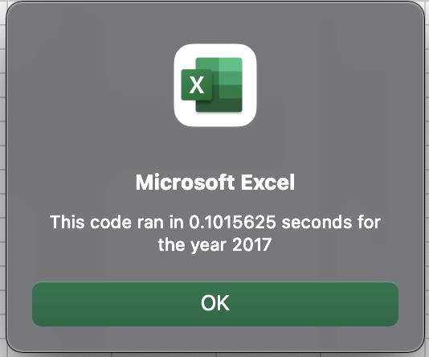
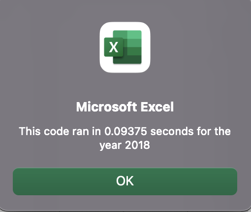
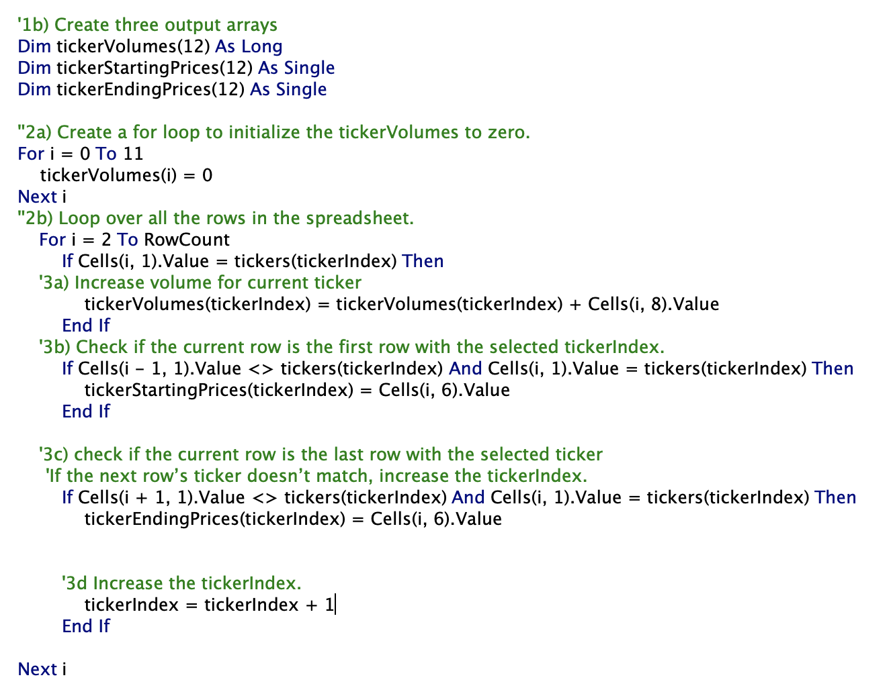

## Overview
This is an analysis of 12 green energy stocks for the years 2017 and 2018, using Visual Basic for Applications in Excel.
## Results
All but one of the 12 stocks performed significantly better in 2017 than 2018. Only two stocks continued the positive return trend through 2018, ENPH and RUN. Although RUN saw the smallest positive return in 2017, so its 84% return in 2018 is comparatively less than that of ENPH over both years at 129.5% in 2017 and 81.9% in 2018. Based on this data, ENPH is the safest green energy stock investment.

#### Execution Times
* The original code for 2017 ran in .52 seconds, the refactored code shows an improved runtime below.

* The original code for 2018 ran in .55 seconds, the refactored code shows an improved runtime below.

## Summary
1. The advantages of refactoring code primarily concern efficiency; it can make a task quicker and less resource-intensive. The disadvantage is potentially breaking functioning code without significant runtime improvement.

2. The refactored VBA script, seen below, did improve the runtime, but it was not very slow to begin with.
